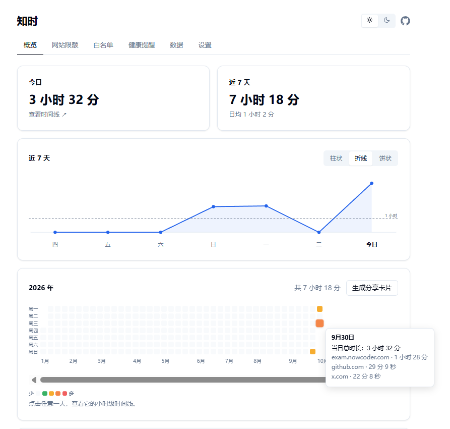
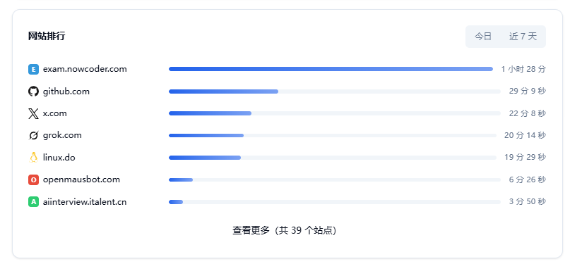
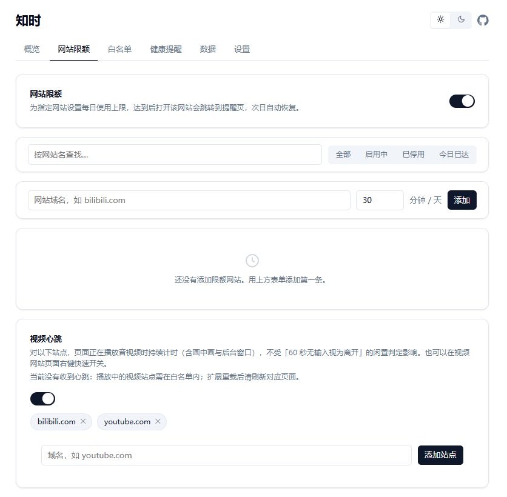
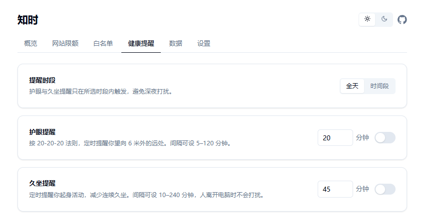
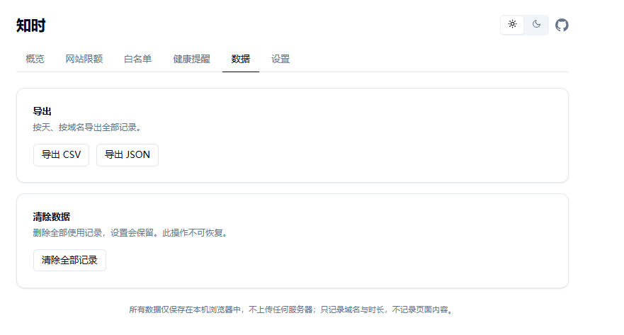
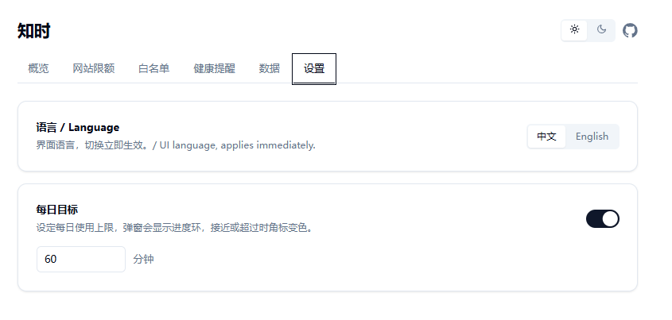

# 知时 · 注意力与健康

一款安静、克制的 Chrome / Edge 扩展：记录每个网站的使用时长，提供护眼与久坐提醒、网站限额与专注模式。**所有数据仅保存在本机**，不上传任何服务器。

视觉体系移植自 [@paradox/ui](https://github.com/1parado/UI_UI)（shadcn 令牌体系、明暗双主题）。

## 界面一览

**概览**：今日 / 近 7 天统计、三种可切换图表、网站排行、年度热力图（悬停看详情，点击进时间线）。

**网站排行**：今日 / 近 7 天可切换，按使用时长或访问次数排序，默认前 7，「查看更多」展开全部；每行**只显示当前排序依据**（按时长排显示时长，按次数排显示次数），另一个维度仍在后台持续记录；点击任意一行即可打开该站点（已开着就切过去）。

**网站限额**：按域名设每日上限，超限跳转拦截页；支持搜索、筛选与时段屏蔽；视频心跳站点也在此页管理。

**健康提醒**：20-20-20 护眼 + 久坐提醒，间隔与提醒时段可调，人不在电脑前不打扰。

**数据**：CSV / JSON 导出，一键清除全部记录。

**设置**：中英双语、浅色 / 暗色 / 跟随系统主题、每日目标。

## 功能

- **使用时长统计**：只统计「标签页活跃 + 浏览器前台 + 系统非闲置」的时间，事件驱动结算、每分钟落盘，精确到秒
- **访问次数统计**：每次「开始停留在某个站点」记一次——切到别的站点再回来算新的一次，窗口失焦再切回不算；时长与次数**始终同时记录**，排行只切换展示哪一个（按次数排就只显示次数，按时长排就只显示时长）
- **视频心跳**：白名单站点播放音视频时持续计时（全屏 / 画中画 / 后台均有效），右键可开关
- **阅读心跳**：滚轮 / 触摸滚动视为人在看，滚动看长文不再被误判离开
- **护眼 / 久坐提醒**：间隔与提醒时段可自定义，角标实时显示今日累计
- **网站限额**：每日上限 + 超限拦截页 + 时段屏蔽，可「放行 10 分钟」；右键一键添加
- **专注模式**：白名单工作模式，开启后仅白名单站点可访问，其余一律拦截（无放行窗口）；右键一键加入 / 移出白名单
- **时间线页**：24 小时色带展示每段使用，悬停看整段起止与时长，点击图例可只看单个站点
- **网站图标**：优先显示网站自己的 favicon（地址由浏览器访问时解析，本扩展只做本地缓存，不抓取也不上传）；未采到的站点回落到内置品牌图标或首字母，可在设置中关闭
- **分享卡片**：今日 / 近 7 天 / 年度一键生成高清 PNG 卡片（大数字总使用、环比趋势、迷你走势、站点排行、全年热力图等），可自定义昵称与头像（仅存本机），弹窗内实时预览
- **中英双语、明暗主题**，均默认跟随系统

## 安装

1. 打开 `chrome://extensions`（Edge 为 `edge://extensions`）
2. 打开右上角「开发者模式」
3. 点「加载已解压的扩展程序」，选择本目录（`browser-extension`）
4. 固定到工具栏即可使用

---

学AI，上[L站](https://linux.do/)
